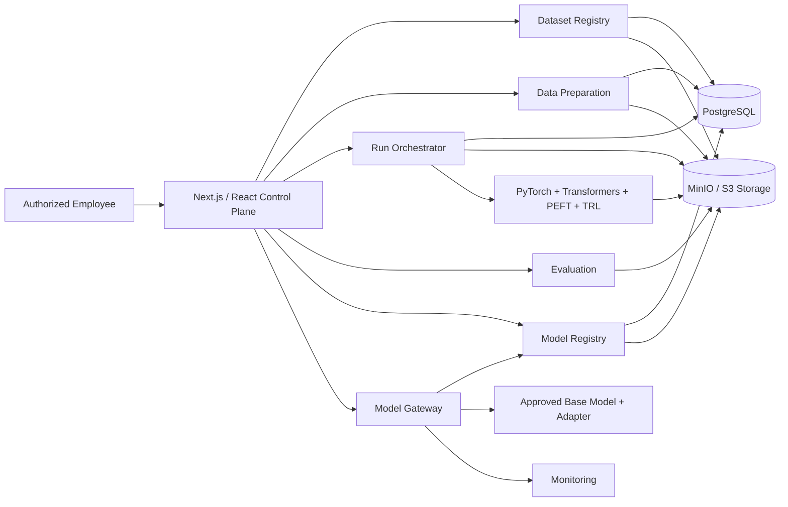
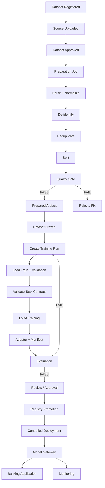

# hdfc-custom-llm-development-pipeline

A governed internal AI development control plane for building, adapting, evaluating, approving, and deploying banking-domain language models with dataset lineage, de-identification, quality gates, parameter-efficient fine-tuning, reproducible artifacts, controlled inference, and operational monitoring.

The repository contains role-separated internal product surfaces and backend services:

- **Control Plane** for authentication, dataset governance, preparation workflows, fine-tuning runs, evaluation, model lifecycle, and deployment control.
- **Review Portal** for evaluation evidence, challenge results, approvals, release decisions, and governed review.

The platform is designed for **internal banking employees and authorized technical, data, ML, risk, security, and operations teams** rather than public customer access.

---

## Capabilities

### Authentication

- Employee sign-up and password login.
- Authenticated `/me` endpoint.
- JWT-based authenticated API access.
- Recent-account login cards with email prefill while never storing passwords.
- Protected dashboard access after login.

### Dataset Governance

- Register datasets with metadata and version information.
- Upload source files to MinIO-compatible object storage.
- Track dataset type, domain, version, source filename, content type, and object key.
- Dataset approval and freeze controls.
- Soft-delete support and future restore capability.
- Dataset lineage preserved through downstream preparation artifacts.

### Data Preparation

- Parse CSV, JSON, XLS/XLSX, PDF, DOCX, and TXT sources.
- Normalize records.
- De-identify sensitive information.
- Chunk document content when required.
- Deduplicate records.
- Split into train, validation, and test sets.
- Run preparation-specific quality gates.
- Persist Parquet artifacts and manifests to MinIO.
- Store prepared-artifact metadata in PostgreSQL.

### Task Generation

- Convert prepared records into canonical fine-tuning task records.
- Support grounded question answering, response drafting, intent classification, terminology normalization, refusal, and escalation.
- Validate task schemas before training.
- Preserve source context and citations.
- Preserve refusal and escalation requirements.
- Keep train, validation, and test splits separate.

### Fine-Tuning

- Governed training runs from approved and frozen prepared artifacts.
- Parameter-efficient adaptation using **LoRA** for the MVP.
- Base-model and tokenizer configuration.
- Learning rate, epochs, batch size, gradient accumulation, seed, and related settings recorded.
- Adapter artifacts uploaded to MinIO.
- Reproducibility manifests generated per run.
- Training states: `QUEUED`, `RUNNING`, `PAUSED`, `COMPLETED`, `FAILED`, `CANCELLED`.

### Evaluation

- Held-out test data remains separate from training.
- Structural dataset validation.
- Task coverage checks.
- Grounding and citation checks.
- Refusal and escalation checks.
- Response quality and task-specific metrics.
- Evaluation evidence retained for review.
- Failed gates can block promotion.

### Controlled Model Lifecycle

- Training metadata stored in PostgreSQL.
- Adapter artifacts stored in object storage.
- Run manifests preserve lineage and reproducibility.
- Model registry integration planned for governed promotion.
- Approval remains separate from training execution.
- Deployment requires evaluation and governance evidence.

### Deployment and Monitoring

- Docker-based service packaging.
- Environment-specific configuration.
- Health checks.
- Model Gateway for controlled inference.
- Monitoring service for SLO and quality signals.
- Controlled rollout and rollback planned.

---

## Architecture



### Technology

| Layer | Technology |
| --- | --- |
| Product UI | Next.js, React, Tailwind CSS |
| Backend APIs | FastAPI, Pydantic |
| Database | PostgreSQL |
| ORM / Migrations | SQLAlchemy, Alembic |
| Object Storage | MinIO / S3-compatible storage |
| Data Format | Apache Parquet |
| Fine-Tuning | PyTorch, Hugging Face Transformers, PEFT, TRL |
| Distributed Compute | DeepSpeed / PyTorch FSDP |
| Experiment Tracking | MLflow |
| Evaluation | lm-evaluation-harness, promptfoo, Giskard |
| Model Registry | MLflow Model Registry / adapter |
| Inference | FastAPI Model Gateway |
| Containers | Docker / Docker Compose |
| Production Orchestration | Kubernetes |

---

## End-to-End Workflow



---

## Data Preparation

The preparation pipeline is:

```text
Source File
    ↓
Parser
    ↓
Normalization
    ↓
De-identification
    ↓
Document Chunking where applicable
    ↓
Deduplication
    ↓
Dataset Split
    ↓
Quality Checks
    ↓
Prepared Artifact
```

Prepared artifacts are stored as:

```text
prepared/
└── <dataset-id>/
    └── <dataset-version>/
        └── <artifact-id>/
            ├── train.parquet
            ├── validation.parquet
            ├── test.parquet
            └── manifest.json
```

The manifest preserves dataset/version lineage, source object, preparation job, split seed, split ratios, record counts, duplicate count, processing flags, and artifact locations.

---

## Task Record Contract

The canonical training record is:

```json
{
  "task_type": "grounded_question_answering",
  "instruction": "What is the status of this request?",
  "context": [
    {
      "doc_id": "source-001",
      "text": "Authoritative source content."
    }
  ],
  "response": "The request is currently under review.",
  "citations": ["source-001"],
  "refusal_required": false,
  "escalation_required": false
}
```

Supported task types:

```text
grounded_question_answering
response_drafting
intent_classification
terminology_normalization
refusal
escalation
```

---

## Fine-Tuning

### MVP

The initial adaptation method is:

```text
LoRA
```

A training run records:

- Base model
- Tokenizer
- Adaptation method
- LoRA rank
- LoRA alpha
- LoRA dropout
- Target modules
- Learning rate
- Epochs
- Batch size
- Gradient accumulation
- Weight decay
- Warmup ratio
- Seed
- Compute profile
- Evaluation plan

A completed run produces:

```text
training/
└── <run-id>/
    ├── adapter.zip
    └── manifest.json
```

The adapter remains separate from the base model so multiple governed adapters can reuse the same base model.

---

## Run Orchestrator

Current API:

```text
POST /api/v1/runs
GET  /api/v1/runs
GET  /api/v1/runs/{run_id}
POST /api/v1/runs/{run_id}/start
POST /api/v1/runs/{run_id}/cancel
POST /api/v1/runs/{run_id}/resume
```

A run references:

```text
dataset_id
prepared_artifact_id
dataset_version
base_model
adaptation
training
compute
evaluation_plan
```

Training is allowed only after the required dataset governance checks.

---

## Evaluation

The intended separation is:

```text
Train       → model adaptation
Validation  → training-time validation
Test        → final held-out evaluation
```

Evaluation can cover:

- Response quality
- Intent accuracy
- Grounding overlap
- Citation presence
- Refusal correctness
- Escalation correctness
- Task-specific metrics
- Safety failures

A failed critical gate blocks promotion.

---

## Authentication and Access Control

The internal product flow is:

```text
Login / Sign-up
       ↓
Authenticated session
       ↓
Overview
       ↓
Governed workspace
```

The UI supports recent-account convenience without saving passwords in browser storage.

Role-aware access is intended for:

```text
Data Engineer
ML Engineer
Reviewer
Risk / Security
Administrator
Operations
```

---

## Repository Map

```text
hdfc-custom-llm-development-pipeline/
│
├── apps/
│   ├── control-plane/
│   │   └── src/
│   │       ├── app/
│   │       ├── components/
│   │       ├── constants/
│   │       ├── providers/
│   │       └── services/
│   │
│   └── review-portal/
│
├── services/
│   ├── database/
│   │   ├── app/
│   │   └── alembic/
│   │
│   ├── dataset_registry/
│   │   └── app/
│   │       ├── api/
│   │       ├── exceptions/
│   │       ├── models/
│   │       ├── repositories/
│   │       ├── schemas/
│   │       ├── services/
│   │       ├── storage/
│   │       └── utils/
│   │
│   ├── data_preparation/
│   │   └── app/
│   │       ├── api/
│   │       ├── artifacts/
│   │       ├── chunking/
│   │       ├── config/
│   │       ├── deduplication/
│   │       ├── deidentification/
│   │       ├── models/
│   │       ├── normalizer/
│   │       ├── parsers/
│   │       ├── quality/
│   │       ├── repositories/
│   │       ├── schemas/
│   │       ├── services/
│   │       ├── splitters/
│   │       ├── task_generation/
│   │       ├── transformers/
│   │       └── workers/
│   │
│   └── run_orchestrator/
│       └── app/
│           ├── models/
│           ├── repositories/
│           ├── routes/
│           ├── schemas/
│           ├── services/
│           └── workers/
│
├── packages/
│   ├── contracts/
│   ├── banking-taxonomy/
│   ├── data-quality/
│   ├── finetuning/
│   ├── evaluations/
│   ├── guardrails/
│   └── observability/
│
├── configs/
│   ├── base-models/
│   ├── lora/
│   └── evaluation-gates/
│
├── artifacts/
├── data/
├── docker-compose.yml
└── README.md
```

---

## Requirements

### Development

- Windows, Linux, or macOS
- Python 3.12 recommended
- Node.js for the Next.js application
- Docker Desktop
- PostgreSQL
- MinIO or another S3-compatible object store
- Git
- VS Code or equivalent editor

### Training

A suitable GPU-backed environment is recommended for practical LLM fine-tuning. A local CPU environment can still be used for API, database, data-preparation, and UI development.

---

## Python Environment

Do not commit virtual environments.

Do not push:

```text
.venv/
venv/
__pycache__/
*.pyc
.env
```

Commit the dependency specification instead:

```text
requirements.txt
```

Deployment creates its own Python environment and installs those dependencies.

---

## Environment Configuration

Typical backend configuration:

```text
APP_NAME
APP_ENV
DATABASE_URL

MINIO_ENDPOINT
MINIO_ACCESS_KEY
MINIO_SECRET_KEY
MINIO_BUCKET
MINIO_SECURE
```

Authentication and model services require their own secret configuration.

Use:

```text
.env
```

locally and provide:

```text
.env.example
```

with safe placeholders.

Never commit production secrets.

---

## PostgreSQL

PostgreSQL stores control-plane state including:

- Users
- Datasets
- Dataset metadata
- Preparation jobs
- Preparation quality reports
- Prepared artifacts
- Training runs
- Training configuration
- Metrics
- Approval and lifecycle metadata

Alembic manages schema changes.

Typical commands:

```bash
alembic current
alembic history
alembic upgrade head
```

Review autogenerated migrations before applying them.

---

## MinIO / Object Storage

MinIO is the artifact-storage boundary.

Prepared data:

```text
prepared/<dataset-id>/<version>/<artifact-id>/
```

Training outputs:

```text
training/<run-id>/
```

Production may use another approved S3-compatible object store.

---

## Running Backend Services

Typical FastAPI entry points:

```text
services/dataset_registry/app/main.py
services/data_preparation/app/main.py
services/run_orchestrator/app/main.py
```

Run them from the service environment using the repository's configured commands and ports.

---

## Docker

Local integration is intended to use Docker Compose.

A production deployment can package services separately:

```text
control-plane
dataset-registry
data-preparation
run-orchestrator
evaluation-service
model-registry-adapter
model-gateway
monitoring-service
postgresql
object-storage
```

Kubernetes becomes useful when GPU scheduling, scaling, isolation, persistent workloads, and controlled rollouts are required.

---

## GitHub Workflow

Push source code and deployment manifests, not local environments.

Commit:

```text
source code
requirements.txt
package.json / lockfile
Dockerfiles
docker-compose.yml
Alembic migrations
configuration templates
tests
README
```

Do not commit:

```text
.venv/
.env
secrets
database dumps
local MinIO data
temporary training outputs
large generated model weights
__pycache__/
```

Typical workflow:

```bash
git status
git add .
git commit -m "feat: update llm pipeline"
git push origin main
```

---

## Reproducibility

A training run should be reproducible from:

```text
Dataset version
+
Prepared artifact
+
Base model
+
Tokenizer
+
LoRA configuration
+
Training configuration
+
Evaluation plan
+
Random seed
+
Code revision
+
Environment / container information
```

The run manifest connects those inputs to the resulting adapter.

---

## Model Release Gate

Training completion is not deployment approval.

```text
Training
   ↓
Evaluation
   ↓
Safety / Privacy / Security checks
   ↓
Review
   ↓
Approval
   ↓
Registry promotion
   ↓
Controlled deployment
```

Critical governance, privacy, security, safety, or rollback failures must block release.

---

## Model Gateway

The Model Gateway is the application-facing inference boundary.

It is responsible for:

- Loading approved model artifacts.
- Applying the approved adapter.
- Request validation.
- Output validation.
- Guardrail enforcement.
- Authentication / authorization.
- Logging and observability.
- Model-version selection.
- Health checks.
- Controlled errors and rollback.

The banking application should call the Model Gateway rather than directly loading model files.

---

## Banking Application Integration

The eventual production flow is:

```text
Banking Application
        ↓
Authenticated Model Gateway
        ↓
Approved Model + Adapter
        ↓
Retrieval / Guardrails
        ↓
Response
```

The Custom LLM Development Pipeline is the development and governance control system. The Model Gateway is the controlled bridge into the deployed banking application.

---

## Security Principles

- Never commit secrets.
- De-identify sensitive training data before model development.
- Restrict training to approved and frozen datasets.
- Keep test data isolated from training.
- Apply least privilege to service credentials.
- Keep model artifacts private.
- Authenticate internal APIs.
- Validate uploaded files.
- Record dataset, model, and deployment lineage.
- Keep audit evidence for governance decisions.
- Protect the inference gateway.
- Maintain rollback capability.
- Treat changing banking policy as authoritative through controlled retrieval/integration rather than relying only on memorized model weights.

---

## Testing

Recommended verification:

```bash
pytest
```

Database:

```bash
alembic current
alembic history
alembic upgrade head
```

Frontend:

```bash
npm run lint
npm run build
```

Integration sequence:

```text
Authentication
  ↓
Dataset registration
  ↓
Dataset approval
  ↓
Preparation
  ↓
Prepared artifact
  ↓
Training run creation
  ↓
Training
  ↓
Evaluation
  ↓
Approval
```

---

## Troubleshooting

### Training run cannot start

Verify:

```text
Dataset is approved
Dataset is frozen
Dataset version matches
Prepared artifact exists
Adaptation configuration is valid
```

### Prepared artifact not found

Check:

```text
prepared_artifacts
dataset_id
dataset_version
prepared artifact ID
MinIO object keys
```

### GPU is unavailable

Use CPU for API/data/UI development and move model fine-tuning to appropriate GPU infrastructure.

### Python imports fail

Confirm VS Code uses the correct Python interpreter and that dependencies are installed from the service requirements file.

### Alembic errors

Run:

```bash
alembic current
alembic history
```

and verify the database revision exists in the local migration directory.

---

## Current Development Status

### Established

- Project architecture
- Authentication
- Login / sign-up
- Overview dashboard
- Dataset Registry
- PostgreSQL
- Alembic migrations
- MinIO storage
- Dataset CRUD
- Dataset approval / freeze controls
- Data Preparation pipeline
- De-identification
- Deduplication
- Dataset splitting
- Quality gates
- Prepared artifacts
- Run Orchestrator foundation
- Training run persistence
- Fine-tuning package foundation
- Evaluation package foundation

### In progress

- Final Task Generation integration
- LoRA execution path
- Evaluation service integration
- Model Registry
- Review and approval UI
- Model Gateway
- Monitoring
- Docker production setup
- GPU training deployment
- Banking application integration

---

## Roadmap

```text
Phase 1
Authentication + Control Plane
        ↓
Phase 2
Dataset Registry
        ↓
Phase 3
Data Preparation + Quality Gates
        ↓
Phase 4
Task Generation
        ↓
Phase 5
LoRA Fine-Tuning
        ↓
Phase 6
Evaluation + Challenge Center
        ↓
Phase 7
Model Registry + Approval
        ↓
Phase 8
Model Gateway
        ↓
Phase 9
Monitoring + SLOs
        ↓
Phase 10
Production Deployment + Banking Application Integration
```

---

## Project Principle

> **A model should never reach production merely because it can generate a response. It must be traceable to approved data, reproducible configuration, evaluated behavior, explicit governance evidence, and a controlled release decision.**

The platform treats:

```text
Data
+
Lineage
+
Preparation
+
Fine-Tuning
+
Evaluation
+
Approval
+
Deployment
+
Monitoring
```

as one governed lifecycle rather than isolated engineering tasks.

---

## Internal Use

This repository is intended for controlled internal development and demonstration.

Production deployment must follow the applicable security, privacy, data-governance, model-risk, access-control, and infrastructure requirements of the target organization.

---

## Explanation link and Demo 
https://drive.google.com/file/d/1aiD3vRyh8DXIZCwZIs0F50p4YDoEXYoi/view?usp=drive_link

## Contribution

Changes should preserve:

- Dataset lineage
- Reproducibility
- Train/test separation
- Security controls
- API contracts
- Migration integrity
- Artifact traceability
- Evaluation evidence
- Deployment safety

For substantial changes, update the relevant documentation, tests, manifests, and API contracts together with the implementation.

